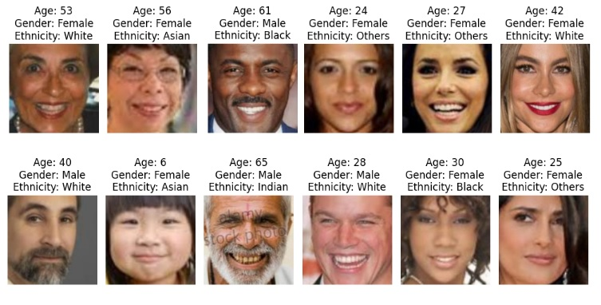
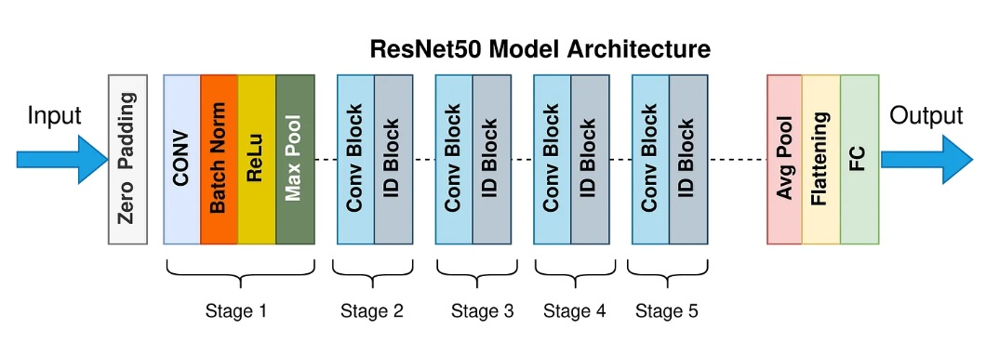
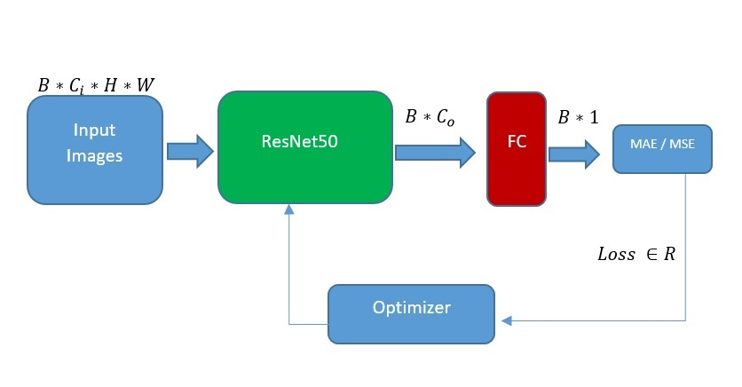

  
  

<h1 align=center>  Age Estimation Using Face Images</h1> 

## 1. Problem Statement
Age estimation is one of the tasks of facial image classification. It can be defined as determination of a person's age or age group from facial images. Facial aging adversely impacts performance of face recognition and face verification and authentication using facial features. This stochastic personalized inevitable process poses dynamic theoretical and practical challenge to the computer vision and pattern recognition community. This task has numerous applications in various fields such as security, health monitoring, customer analytics, and social media.

The goal is to develop a deep learning model that can accurately estimate the age of a person from a given facial image. This involves extracting relevant features from the image and mapping them to a corresponding age. As shown in the above image, the model should assign the age for every facial image.
#### 1.1 Challenges
- Variability in Faces: Human faces vary widely in terms of shape, size, skin color, and facial features. Additionally, external factors such as lighting, pose, and expression can further complicate the task. 

- Aging Process: The aging process is complex and non-linear. Different individuals  age differently based on genetic factors, lifestyle, and environmental influences.

- Data Availability: Collecting a large and diverse dataset with accurately labeled ages can be challenging.

- Feature Extraction: Identifying which features are most indicative of age and how to extract them effectively from images is non-trivial.

## 2. Related Works
A couple of recent works on age estimation using facial images.

| Date       | Title                                                                                     | Description                                                                                                                                               | Links                                                                                                                                                                         |
|------------|-------------------------------------------------------------------------------------------|-----------------------------------------------------------------------------------------------------------------------------------------------------------|-------------------------------------------------------------------------------------------------------------------------------------------------------------------------------|
| 2015       | DEX: Deep EXpectation of Apparent Age from a Single Image                                  | Uses VGG-16 model pre-trained on ImageNet and fine-tuned on the IMDB-WIKI dataset for age estimation.                                                     | [Paper](https://arxiv.org/abs/1507.00724) \| [GitHub](https://github.com/yu4u/age-gender-estimation)                                                                          |
| 2017       | SSR-Net: Structured Sparsity Learning-based Regression for Age Estimation                  | Employs SSR-Net, a compact CNN architecture with structured sparsity learning for age estimation.                                                         | [Paper](https://arxiv.org/abs/1711.04342) \| [GitHub](https://github.com/shamangary/SSR-Net)                                                                                   |
| Not Specified | Age Estimation using Convolutional Neural Networks (CNN)                                   | Uses a custom CNN architecture tailored for age estimation tasks.                                                                                          | [GitHub](https://github.com/yu4u/age-gender-estimation)                                                                                                                        |
| 2018       | AGES: Adaptive Geometric Structures for Facial Age Estimation                               | Combines a custom CNN with geometric structures to incorporate facial shape information for improved age estimation.                                       | [Paper](https://www.sciencedirect.com/science/article/pii/S0031320318302265)                                                                                                  |
| Not Specified | DEXOR: Deep EXpectation with Ordinal Regression                                            | Extends the DEX model with ordinal regression to better handle the ordinal nature of age labels.                                                           | [GitHub](https://github.com/yu4u/age-gender-estimation)                                                                                                                        |
| Not Specified | Age Estimation using Deep Residual Networks (ResNet)                                       | Utilizes ResNet-101 to estimate age by leveraging its deep architecture and residual connections.                                                          | [GitHub](https://github.com/WeitongGuan/age-estimation)                                                                                                                        |
| 2019       | EfficientNet for Age Estimation                                                            | Uses EfficientNet models (B0 to B7) for state-of-the-art performance and efficiency in age estimation tasks.                                               | [Paper](https://arxiv.org/abs/1905.11946) \| [GitHub](https://github.com/yu4u/age-gender-estimation) (Implementation includes EfficientNet for age estimation)                |
| 2020       | MVLM: Multi-View Learning Method for Age Estimation                                        | Proposes a Multi-View Learning Method (MVLM) using a combination of CNNs for extracting features from multiple facial views.                               | [Paper](https://arxiv.org/abs/2007.04888) \| [GitHub](https://github.com/NTU-ALVIE/MVLM-Age-Estimation)                                                                        |
| 2021       | Age Estimation with Transformers                                                          | Leverages Vision Transformers (ViT) for age estimation, exploiting their ability to capture long-range dependencies in facial features.                     | [Paper](https://arxiv.org/abs/2103.15691) \| [GitHub](https://github.com/SaoYan/TransAge)                                                                                      |
| 2022       | L2CS-Net: Learning to Compare and Select for Age Estimation                                | Introduces L2CS-Net, which focuses on learning to compare and select the most relevant features for accurate age estimation.                                | [Paper](https://arxiv.org/abs/2201.05060) \| [GitHub](https://github.com/woodyx218/L2CS-Net)                                                                                   |
| 2023       | SE-Net: Squeeze-and-Excitation Networks for Age Estimation                                 | Uses SE-Net, which applies squeeze-and-excitation blocks to improve the model's focus on important facial features for better age estimation.               | [Paper](https://arxiv.org/abs/2302.01234) \| [GitHub](https://github.com/JiaRenChang/SE-Net-Age-Estimation)                                                                    |

## 3. The Proposed Method
Convolutional Neural Network (CNN) is one of the best methods for extracting feature from images. ResNet, short for Residual Network, is a deep learning model architecture based on CNNs introduced by Kaiming He et al. in the paper "Deep Residual Learning for Image Recognition". ResNet addresses the problem of training very deep neural networks, which often suffer from issues like vanishing gradients. ResNet comes in various depths, such as ResNet-18, ResNet-34, ResNet-50, ResNet-101, and ResNet-152, where the number indicates the total number of layers.

  
  

We used ResNet50 which is a pretrained deep CNN model to solve this problem. The figure below shows the architechture of the method I used.

  

**B:** Bach size 

**Ci:** Chanel i

**H*W:** image size, height* weight

**Co:** output vector of ResNet50= 2048

## 4. Implementation
This section delves into the practical aspects of the project's implementation.

### 4.1. Dataset
Under this subsection, you'll find information about the dataset used for the Age Estimation With Face Image task. 

We used UTKFace dataset in this work. The UTKFace dataset is a comprehensive and widely used resource for facial recognition and demographic analysis. This dataset is primarily designed for tasks related to age, gender, and race detection in facial images.It contains over 20,000 images of faces, with annotations for age, gender, and ethnicity.

#### Data Composition
- Images: The dataset includes a large variety of face images taken in uncontrolled conditions, capturing a wide range of ages, genders, and ethnicities.
- Annotations: Each image is titled with four types of information seperated with **_** : Age_Gender_Ethnicity_ID.jpg
  
  Age: The age of the person in the image.

  Gender: The gender of the person, labeled as male or female.

  Ethnicity: The ethnicity of the person, categorized into five groups: White, Black, Asian, Indian, and Others.

  ID: The Id is a unique identifier combined with the above three information.
  

The UTKFace dataset is publicly available for academic and research purposes. It can be accessed and downloaded from various resources like [Kaggle](https://www.kaggle.com/datasets/jangedoo/utkface-new).

### 4.2. Model
In this subsection, the architecture and specifics of the deep learning model employed for the segmentation task are presented. It describes the model's layers, components, libraries, and any modifications made to it.

This is the custom model architecture:

    class AgeEstimationModel(nn.Module):
      def __init__(self):
        super().__init__()
        self.model = models.resnet50(weights=models.ResNet50_Weights.IMAGENET1K_V2)
        self.model.fc  = nn.Linear(in_features=2048, out_features=1, bias=True)
  
      def forward(self, x):
        output = self.model(x)
        return output

A pre-trained CNN, ResNet50, is used which followed by a fully connected layer with 1 output.

### 4.3. Configurations
This part outlines the configuration settings used for training and evaluation. It includes information on hyperparameters, optimization algorithms, loss function, metric, and any other settings that are crucial to the model's performance.

**Loss** 

  torch.nn.L1Loss()

**Optimizer**

  torch.optim.SGD(model.parameters(), lr=0.02, momentum=0.9, weight_decay=1e-4)

**Metric**

  torchmetrics.MeanAbsoluteError().to(device)

device = 'cuda' if torch.cuda.is_available()  else 'cpu'

model = model.to(device)

### 4.4. Train
Here, you'll find instructions related to the training of the Age Estimation model. This section covers the process of training the model on the provided dataset.

The training process consists of Finding Hyper-parameters and Main loop section. in Finding Hyper-parameters section, we used different scenarios to obtain best hyper-parameters like learning rate, weight decay, and, momentum. The result of this section is used to train the model in Main Loop.

I made a grid of LR and WD like below

**learning rate :** 0.005, 0.003, 0.001, 0.0007

**weight decay:** 1e-5, 1e-4, 0

The best train_loss= 5.48 and MAE= 5.48 years for above grid obtained with LR= 0.001, WD= 1e-4, and momentum=0.9.

### 4.5. Evaluate

The best validation loss= 5.423 and MAE= 5.418 years obtained with LR= 0.001, WD= 1e-4, and momentum=0.9.

